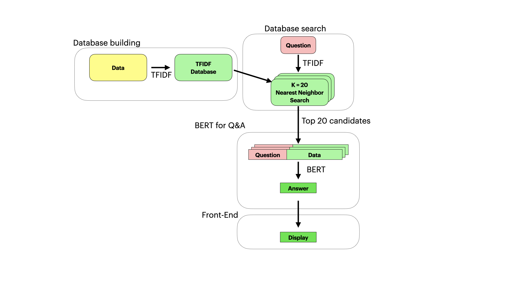

# COVID-19 Q&A with BERT

# Motivation

The White House and leading research groups have challenged the mechine learning community to come up with text mining NLP approachs to support the ongoing fight against the COVID19 pandemic. The rapidly growing body of research on COVID19 makes it difficult for researchers and the public to keep up with. With this urgent need in mind, I develop a text retrieval and question answering model aiming at pointing the researchers or general public to the right resources.


# Rationale

In my [previous work](https://arxiv.org/pdf/2006.01997.pdf) on COVID19, I built a text summarization tool, based on GPT2 model. In this work I try to work on another task which is building a question answering tool for COVID19.

To be more precise, My vision is to build an easy tool for general public to access information about COVID19 from a trusted knowledge sources. The query takes the form of a plaintext question, and the answer involves extracting answer from reference texts. To ensure the scientific accuracy, the reference texts that I select are peer-reviewed research articles curated by Pubmed and released to the public by the Allen Institute For AI and collaborators. The dataset can be found [here](https://www.kaggle.com/allen-institute-for-ai/CORD-19-research-challenge).

# Approach

The work is subdivided into 3 parts. 
1. building the searchable database of research articles. 
2. building a pipeline for retrieving relevant articles from the database based on a query and extracting potential answers from the database. 
3. building a front-end interactive graphical interface that provides a querying and output interface for general public users.

<p align="center">
<br>
<font size="2"><b>Figure 1.</b> The overall workflow of the COVID-19 Question answering with BERT  </font>
</p>

# Task Lists

- [x] Database building

- [x] Implement database search

- [x] Implement Question Answering

- [x] Supplement the database

- [x] Build the front-end

- [ ] Deployment


# Database

## Database building

To build a searchable database of COVID19, I selected the abstracts and the url links from research articles. Most abstracts are approximately 500 words in length about the maximum token lengths for BERT. This makes the pre-processing very easy. There are about 127K articles in the dataset that contains both abstracts and urls. 

To create search keys, I tried text embedding techniques, BERT and TFIDF. The idea is that the retrieval is based on similarity between the query and the keys. Let's us examine each approach. 

1. BERT, is a massive neural network model that has to be pre-trained before it can be used. The model is trained on a context prediction task where the model uses surrounding context to predict the masked-out words. After training on massively large dataset, BERT learns associations between words and the context. The architecture behinds this model is the **transformer encoder** architecture. You can read more about the transformer encoder [here](http://jalammar.github.io/illustrated-bert/). In this case, BERT embeds a block of 512 tokenized abstract to a 768 dimensional vector. This 768 dimensional vector represents a semantic meaning of the whole abstract.

2. The TFIDF vectorization approach is very different. The article is represented as a collection of key words weighted by the frequency in the documents and offset by the number of documents that the words appear in. Key word extraction is performed at the word level, resulting in loss of context at higher semantic level. To select the key words, I remove the stop words, remove all punctuations, lowercase the text, and stem the words to their root forms. This is done to ensure that all words in different parts of speech are grouped together as the same key.

Each approach has **pros** and **cons**. 

- BERT can capture synonyms like "dog" and "puppy" due to the fact that "dog" and "puppy" are more likely to appear in the same context rather than other random words. TFIDF, on the contrary, treat all words as uniques. 
- The down side is that running BERT is much slower.

In the end, I found that TFIDF is a better embedding tool for this task. It is much faster and seems to be more accurate when I spot check the result. This may be due to the fact that query (question) and the text reference (abstract) might not be semantically similar with regards to BERT embedding. They may, however, share the same sets of relevant keywords. 

## Database search

 I use nearest neighbor algorithm to search the relevant articles. This is done by first transform the querying questions using the same TFIDF set of weights that was previously used for building the database. The distance metric used for nearest neighbors is cosine similarity of the TFIDF vectors. For each query, top 20 articles are selected as candidates for the subsequent question answering task.

# Question Answering

In order to narrow down the input for the BERT model, top 20 articles are selected using TFIDF. This has to be done because using BERT on the whole dataset would takes prohibitively long time. I experimented with 2 models of BERT. 

1. the pre-trained DistilBert fined-tuned for question answering on SQuAD dataset. This dataset is a more generic QA task that focus mainly on real-world question comprehension. 

2. the DistilBert that I fine-tuned on COVID19 question answering dataset. The dataset is annotated by professionals and open-sourced by deepset-AI. It can be downloaded [here](https://github.com/deepset-ai/COVID-QA). I trained the COVID19 specific question answering on top of a pre-trained question-answering model to make sure that the knowledge of general task is transfered to the COVID19 specific task.

I will not go over in details how BERT performs question answering. Briefly, BERT is fine-tuned to performs token classification. It classifies 2 types of tokens: the start-of-the-answer and the end-of-the-answer. The answer from BERT is, therefore, the span of tokens from the start to the end. Read more about how BERT for Question Answering works [here](https://mccormickml.com/2020/03/10/question-answering-with-a-fine-tuned-BERT/).

In the end I found that the pre-trrained BERT is already pretty OK. So after weighing in the cost of hosting the newly trained weight tensor, I decided to still use the pre-trained version.

## supplement with Wikipedia

After I finished implementing the question answering part, I found that some easy questions on COVID19 do not have answers in the dataset I have, or the answers cannot be retrieved. So I decided to supplement this dataset with information found in [wikipedia](https://en.wikipedia.org/wiki/Coronavirus_disease_2019). The whole wikipedia on this is quite extensive, with about 250 lines of plaintext. So I break it up into 34 chunks of text with 50 tokens overlaps. To perform BERT question answering, I then pair the question along with the 34 chunks of wikipedia tokens and retrieve the answer.

<p align="center">
<br>
<font size="2"><b>Figure 2.</b> The updated workflow inclduing the wikipedia article added to supplement the research articles </font>
</p>


# Front-end

Now the last step is to build a front-end where users can interact with the data access pipelines. I designed the front end to be an interactive web application where users can write down a question about COVID19 and submit it to the data pipeline (back-end). The back-end performs a query search in the database using TFIDF. The search results consists of the abstracts of the research articles and the url of the articles. The abstracts are then fed to BERT model. The BERT model extracts the answer content from the results. Finally, the answer along with the url are formatted to dataframe and return back to the front end which gets displayed as a table. I designed two tables one for the COVID19 research articles. The other table is the wikipedia article. I added a clickble switch so the users can switch between two tables.

For the implementation, I used [Dash packages](https://plotly.com/dash/) from Plotly. This allows me to work mostly in Python. The final work is in the ```application.py``` file. All the packages used for this work is in the ```requirements.txt```. 
After launch, the webapp looks like this...

<p align="center">
<br>
<font size="2"><b>Figure 3.</b> screen shot of the interactive web app launch locally. This can be access on http://localhost:5000 </font>
</p>


# Deployment

This step will be done in the near future.
I plan to test the deployment in either GCP or AWS. Note that this is a personal development work and I have limited budget, so I will have to calculate the cost of hosting the BERT model on the cloud (which could be quite considerable) and see if it'll break the bank. 

# Citation

1. [The COVID-19 Open Research Dataset](https://www.kaggle.com/allen-institute-for-ai/CORD-19-research-challenge)
This is the peer-reviewed research articles dataset. It has over 100K of articles and it updates very frequently.

2. [Wikipedia](https://en.wikipedia.org/wiki/Coronavirus_disease_2019)
The one of several wikipedia pages on this topic. It is very detailed.

3. [The Illustrated BERT, ELMo, and co.](http://jalammar.github.io/illustrated-bert/)
This blog post by Jay Alammar provides a easy to read, and good illustration for BERT. It is widely cited as aims at giving high-level conceptual understanding of BERT.

4. [Deepset-AI](https://github.com/deepset-ai/COVID-QA)
This is the open source project that provides the labeled COVID19 question answering data. It also used to have hosted user interface, but it decided to make it offline. 

5. [Question Answering with a Fine=Tuned BERT](https://mccormickml.com/2020/03/10/question-answering-with-a-fine-tuned-BERT/)
This is a blogpost in a series of BERT blogpost by Chris McCormick. It aims at beginners and provides codes, youtube walkthrough, and colab notebook. It is really a big help for me when I first learned it.

6. [Huggingface's Transformers](https://huggingface.co/transformers/)
This library provides an easy-to-use BERT model implemented in Pytorch. It has a lot of resources for NLP machine learning work.

6. [Dash-plotly](https://plotly.com/dash/)
This library provides an interactive web app, similar to Flask but abstracts away a lot of low-level work. Mostly it is good for dashboard and interactive web app. 

